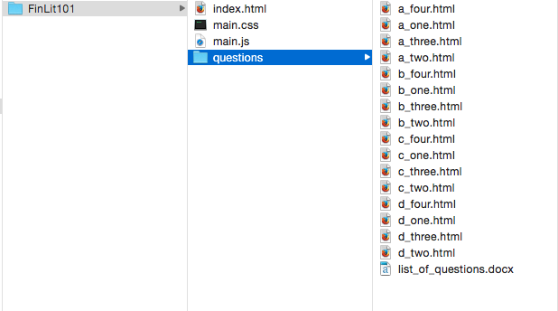
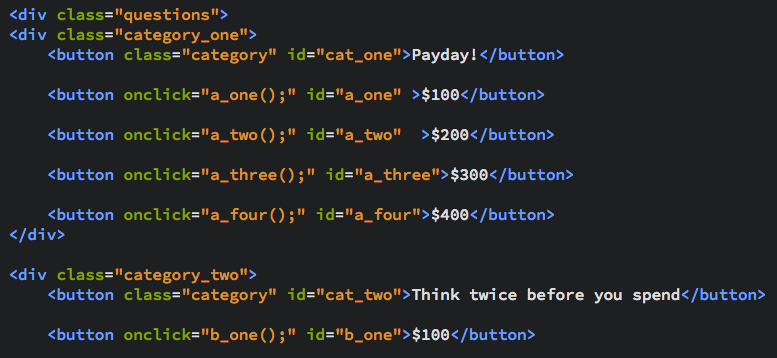
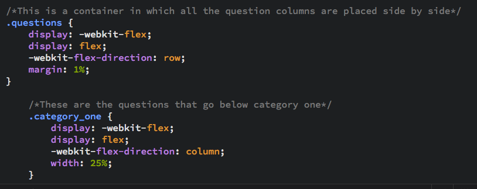
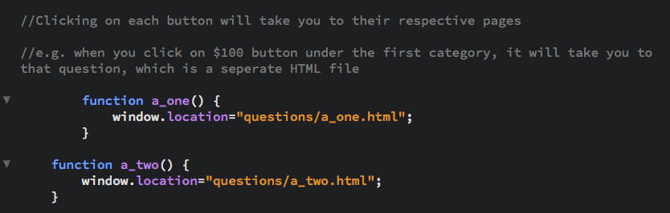
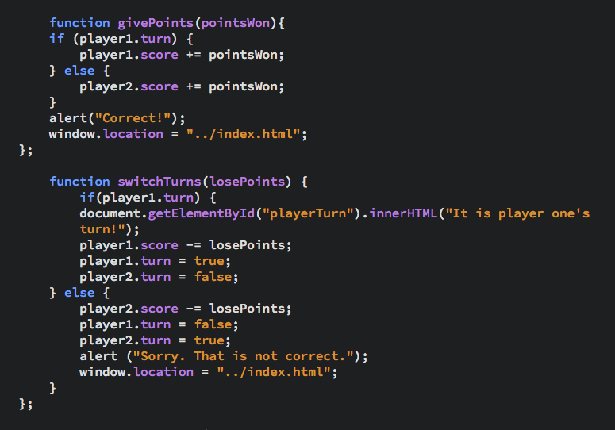
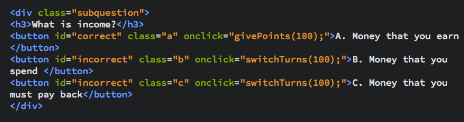
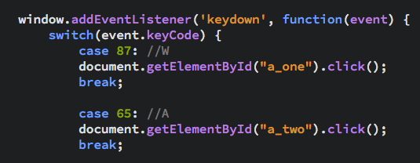

<html>
<head>
<i>This is a Jeopardy-style game that teaches the basics of financial literacy to adolescence.</i>
</head>
<body>
<b>Materials: </b>
<ul>
<li> Makey Makey Standard Kit(2)</li> 
<li> Allegator clips (<i>usually included in the Makey Makey Standard Kit</i>)</li> 
<li> Wires (<i>usually included in the Makey Makey Boards</i>) </li> 
<li> Computer </li> 
<li> Brackets (or any other progamming software)</li> 
<li> Canvas (preferrably 8" by 14", but any size larger can work)</li> 
<li> Scissors</li> 
<li> Play-Doh</li> 
<li> Magnetic stickers</li>  
<li> Card stock </li> 
<li> Super glue</li> 
</ul>

<b>INSTRUCTIONS:</b>

<b>Folder Setup</b>
<ol>
<li> Create a folder that includes the following documents: "index.html", "main.css", "main.js" </li> 
<li> Within that folder, create another folder and label it as "questions" (this is where you will place all the questions - each question page will be a seperate html file.) </li> 
</ol>
<i>Your folder setup should look like this:</i> 

<b>Coding the Game</b>
<ol>
<li> index.html: is the main page that will include 4 categories and 4 buttons under each category that will link to the respective question. When coding the page, questions are categorized in 4 different div classes (each div class represents a category), and these divs are all inside one div class ("questions"). </li> 

<li> main.css: Now that you have set up your index.html, style your buttons using css. Since we have already placed questions inside div containers, setting up buttons into rows and columns should be simple, using flexbox. Here is how I set up mine </li> 
<li> main.js: So how can we click on a question button and have it take you to that page? We can add functions in a javascript file and add an event listener in the index.html as shown above. 
</li>
<li>Once we get to the question page, we want to make sure that once the user answers the multiple choice queston, it should take them back to the index.html page. These functions should do the trick.  Don't let the points confuse you. This is something that I'm currently working on, but it will work nontheless. Add some event listeners to the multiple choice. This is how the code should look: </li>
</ol>
<b>Making the Board</b>
<ol>
<li>With a pencil, divide the canvas into 4 columns and 5 rows (the top column is for categories). Draw the grids very lightly, you will erase these lines after.</li>
<li>With a pair of scissors, poke one hole in the center of each cell. This is where you will place buttons made out of green Play-Doh (you can choose any colour, as long as all the questions have the same colour). </li>
<li>Cut out card-stock into rectangles - the same size as each cell on the canvas, only a little smaller. Within each rectangle, be sure to cut out a circle so there is room for the user to press the Play-Doh button. Label each cardstock according to the question amount. When a player answers the question correctly, they can remove the money and keep it with them. At the end of each game, they can use the magnets to stick the questions back on. </li>
<li>Stick some magnetic strips onto the back of the cardstock and on the board. You can use super glue to ensure it sticks well to the canvas. </li>
</ol>
<b>Makey Makey Board</b>
<ol>
<li>Using the different allegator clips, connect each button to a question button. Since our game has 16 questions, you will need to remap the second Makey Makey board in order to fit the number of questions. Visit <a href="http://makeymakey.com/remap/">this link </a> to remap </li>
<li>Each button will require a character code. Use the following function: 
</li>
</ol>

</body>
</html>

